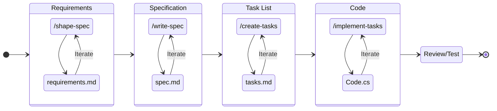

# Was wir gemacht haben (AgentOS v2)

```mermaid
stateDiagram-v2
    direction LR
    [*] --> ShapeWrapper

    state "Requirements" as ShapeWrapper {
        state "/shape-spec" as ShapeSpec
        state "requirements.md" as Requirements
        ShapeSpec --> Requirements
        Requirements --> ShapeSpec : Iterate
    }

    ShapeWrapper --> SpecWrapper

    state "Specification" as SpecWrapper {
        state "/write-spec" as WriteSpec
        state "spec.md" as Spec
        WriteSpec --> Spec
        Spec --> WriteSpec : Iterate
    }

    SpecWrapper --> TaskWrapper

    state "Task List" as TaskWrapper {
        state "/create-tasks" as CreateTasks
        state "tasks.md" as Tasks
        CreateTasks --> Tasks
        Tasks --> CreateTasks : Iterate
    }

    TaskWrapper --> ImplementWrapper

    state "Code" as ImplementWrapper {
        state "/implement-tasks" as ImplementTasks
        state "Code.cs" as Code
        ImplementTasks --> Code
        Code --> ImplementTasks : Iterate
    }

    state "Review/Test" as Review

    ImplementWrapper --> Review
    Review --> [*]
```