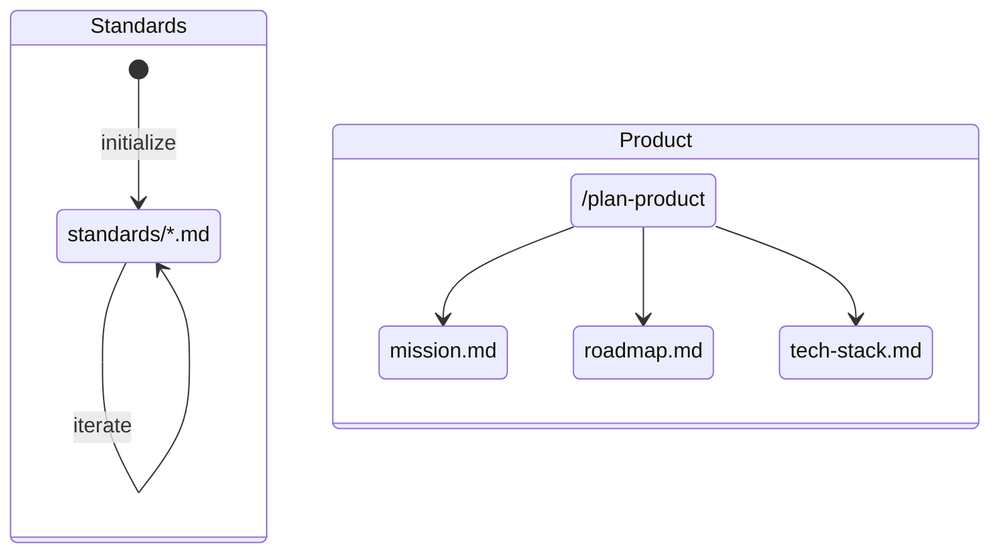

# Was wir gemacht haben (AgentOS v2)

```mermaid
stateDiagram-v2
    direction TB
    state "Standards" as StandardsWrapper {
        direction TB

        state "standards/*.md" as Standards
        [*] --> Standards : initialize
        Standards --> Standards : iterate
    }

    state "Product" as PlanProductWrapper {
        direction TB
        state "/plan-product" as PlanProduct
        state "mission.md" as Mission
        state "roadmap.md" as Roadmap
        state "tech-stack.md" as TechStack
        PlanProduct --> Mission
        PlanProduct --> Roadmap
        PlanProduct --> TechStack
    }
```