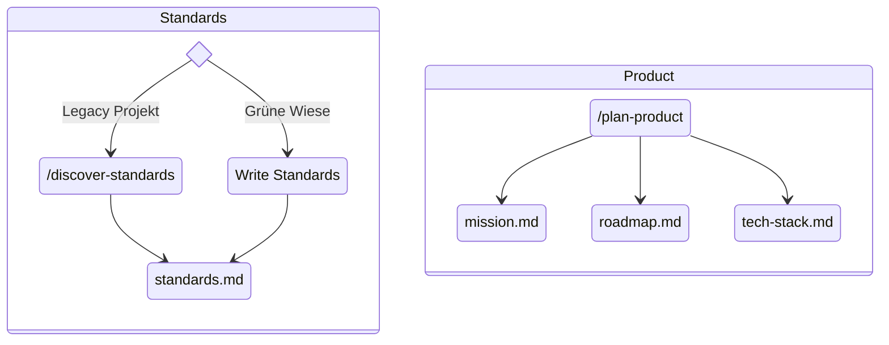

# Was man mittlerweile macht (AgentOS v3)

```mermaid
stateDiagram-v2
    direction TB
    state "Standards" as StandardsWrapper {
        direction TB
        state IsLegacy <<choice>>
        
        state "/discover-standards" as DiscoverStandards
        state "Write Standards" as WriteStandards
        IsLegacy --> DiscoverStandards : Legacy Projekt
        IsLegacy --> WriteStandards : Grüne Wiese
        state "standards.md" as Standards
        DiscoverStandards --> Standards
        WriteStandards --> Standards
    }

    state "Product" as PlanProductWrapper {
        direction TB
        state "/plan-product" as PlanProduct
        state "mission.md" as Mission
        state "roadmap.md" as Roadmap
        state "tech-stack.md" as TechStack
        PlanProduct --> Mission
        PlanProduct --> Roadmap
        PlanProduct --> TechStack
    }
```