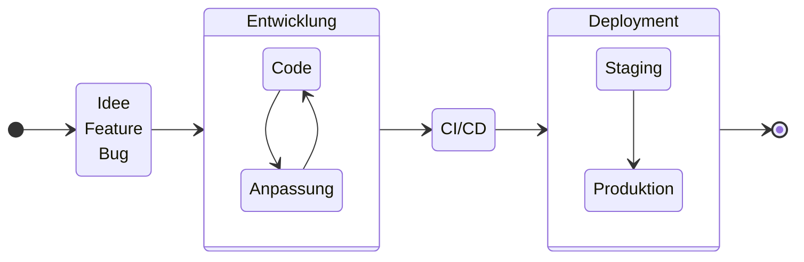
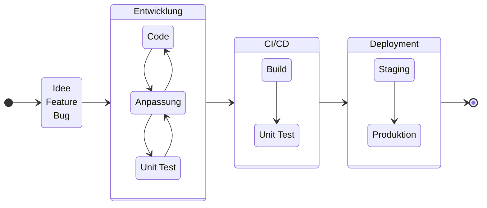
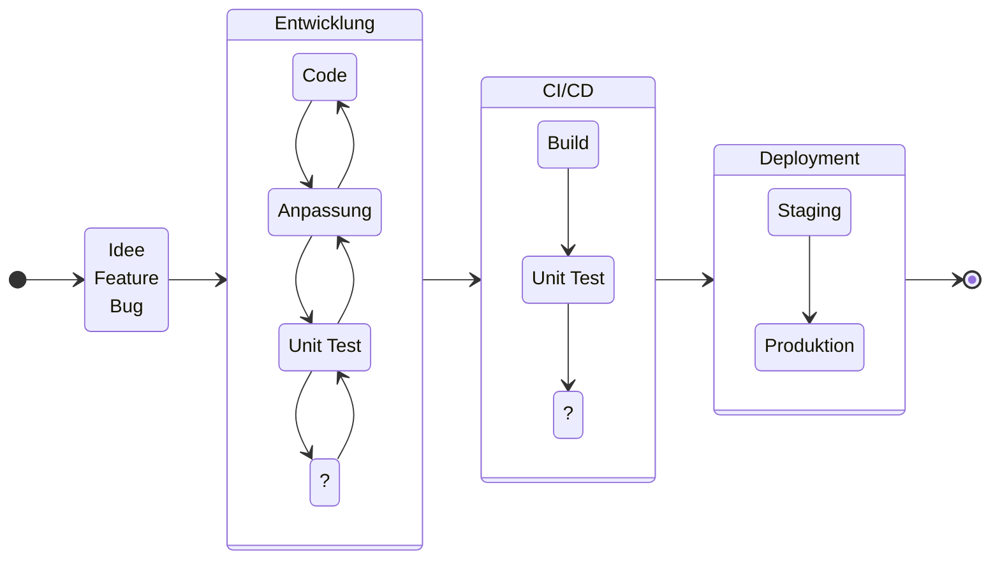

# Software Lifecycle

```mermaid
stateDiagram-v2
    direction LR

    state "Idee<br/>Feature<br/>Bug" as Idee
    [*] --> Idee
    Idee --> CodeWrapper

    state "Entwicklung" as CodeWrapper {
        state Code
        state Anpassung

        Code --> Anpassung
        Anpassung --> Code
    }

    state "CI/CD" as Pipeline

    state "Deployment" as ProductionWrapper {
        state Staging
        state Produktion

        Staging --> Produktion
    }

    CodeWrapper --> Pipeline
    Pipeline --> ProductionWrapper
    ProductionWrapper --> [*]
```

---
layout: default
---

# Software Lifecycle

```mermaid
stateDiagram-v2
    direction LR

    state "Idee<br/>Feature<br/>Bug" as Idee
    [*] --> Idee
    Idee --> CodeWrapper

    state "Entwicklung" as CodeWrapper {
        state Code
        state Anpassung

        Code --> Anpassung
        Anpassung --> Code
        
        state "Unit Test" as LocalUnitTest
        Anpassung --> LocalUnitTest
        LocalUnitTest --> Anpassung
    }

    state "CI/CD" as Pipeline {
        state Build
        state "Unit Test" as PipelineUnitTest

        Build --> PipelineUnitTest
    }

    state "Deployment" as ProductionWrapper {
        state Staging
        state Produktion

        Staging --> Produktion
    }

    CodeWrapper --> Pipeline
    Pipeline --> ProductionWrapper
    ProductionWrapper --> [*]
```

---
layout: default
---

# Software Lifecycle

```mermaid
stateDiagram-v2
    direction LR

    state "Idee<br/>Feature<br/>Bug" as Idee
    [*] --> Idee
    Idee --> CodeWrapper

    state "Entwicklung" as CodeWrapper {
        state Code
        state Anpassung

        Code --> Anpassung
        Anpassung --> Code
        
        state "Unit Test" as LocalUnitTest
        Anpassung --> LocalUnitTest
        LocalUnitTest --> Anpassung

        state "?" as LocalTestTest
        LocalUnitTest --> LocalTestTest
        LocalTestTest --> LocalUnitTest
    }

    state "CI/CD" as Pipeline {
        state Build
        state "Unit Test" as PipelineUnitTest
        Build --> PipelineUnitTest

        state "?" as PipelineTestTest
        PipelineUnitTest --> PipelineTestTest
    }

    state "Deployment" as ProductionWrapper {
        state Staging
        state Produktion

        Staging --> Produktion
    }

    CodeWrapper --> Pipeline
    Pipeline --> ProductionWrapper
    ProductionWrapper --> [*]
```
